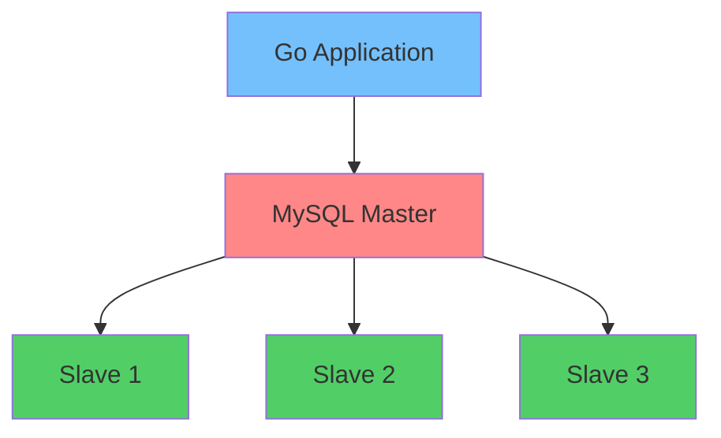

# 🚀 Go Database Replication

> A robust and scalable Go application with MySQL master-slave replication running in Docker containers! 💾


## 📖 Overview

This project demonstrates a **high-availability database architecture** using MySQL master-slave replication with a Go backend. Perfect for learning about distributed systems and database scaling! 🎯

### ✨ Features

- 🏗 **Master-Slave Replication** - 1 Master + 3 Slave nodes
- 🐳 **Docker Containerized** - Easy deployment and scaling
- 🔄 **Automatic Failover** - Built-in replication monitoring
- ⚡ **High Performance** - Read scalability across multiple slaves
- 🔒 **Data Consistency** - ACID compliance with replication
- 📊 **Health Monitoring** - Built-in database health checks

## 🏗 Architecture


🛠 Tech Stack

Component->Technology->Purpose

Backend	 High-performance API server

Database		Primary data storage 

Container		Environment isolation

Orchestration		Multi-container management

🚀 Quick Start
Prerequisites

🐳 Docker

🐳 Docker Compose

⚙️ Go 1.25.3+ (for local development)

Installation
Clone the repository

bash
```
git clone https://github.com/FollG/go-database-replication.git

cd go-database-replication
```
Start the environment

bash

# Start all services (Master + 3 Slaves + Go App)
```
docker-compose up -d
```
Verify services are running

bash
```
docker-compose ps
```
✅ You should see 5 containers running!

Check replication status

bash
# Connect to master and check slave status
docker-compose exec mysql-master mysql -uroot -psecret -e "SHOW SLAVE HOSTS;"
📁 Project Structure
text
```
go-database-replication/
├── 📁 app/                 # Go application source code
│   ├── main.go            # Application entry point
│   ├── database/          # Database connection logic
│   └── models/            # Data models
├── 📁 config/             # Configuration files
│   ├── master.cnf         # MySQL Master configuration
│   └── slave.cnf          # MySQL Slave configuration
├── 📁 scripts/            # Database initialization scripts
├── docker-compose.yml     # Multi-container setup
└── README.md             # This file 🎉
```
⚙️ Configuration

Environment Variables

| Variable            | Default	Description                                |
| --------------------|:--------------------------------------------------:|
| DB_MASTER_HOST      | mysql-master	(Master database host)               |
| DB_MASTER_PORT      | 3306	(Master database port)                       |
| DB_SLAVE_HOSTS      | slave1,slave2,slave3 (Comma-separated slave hosts) |
| DB_USER             | slave1,slave2,slave3 (Comma-separated slave hosts) |
| DB_PASSWORD         | app_user	(Database username)                      |

DB_PASSWORD	app_password	Database password
🧪 Testing the Replication
Write to Master
bash
# This will create data on the master
curl -X POST http://localhost:8080/api/data \
  -H "Content-Type: application/json" \
  -d '{"message": "Hello from Master!"}'
Read from Slaves
bash
# This will read from slave nodes (round-robin)
curl http://localhost:8080/api/data
🐛 Troubleshooting
Common Issues
Connection Refused

bash
# Check if containers are running
docker-compose ps

# Check master logs
docker-compose logs mysql-master
Replication Not Working

bash
# Check slave status
docker-compose exec mysql-slave1 mysql -uroot -psecret -e "SHOW SLAVE STATUS\G"
Application Can't Connect

bash
# Verify network
docker network ls
docker network inspect go-database-replication_default
🤝 Contributing
We love contributions! 🎉 Here's how you can help:

🍴 Fork the project

🌿 Create your feature branch (git checkout -b feature/AmazingFeature)

💾 Commit your changes (git commit -m 'Add some AmazingFeature')

📤 Push to the branch (git push origin feature/AmazingFeature)

🔃 Open a Pull Request

📜 License
This project is licensed under the MIT License - see the LICENSE file for details.

🙏 Acknowledgments
MySQL Documentation for replication setup

Docker community for excellent containerization guides

Go community for best practices and libraries

<div align="center">
⭐ Don't forget to star this repo if you found it helpful! ⭐

Made with ❤️ and ☕ by FollG

</div> ```
