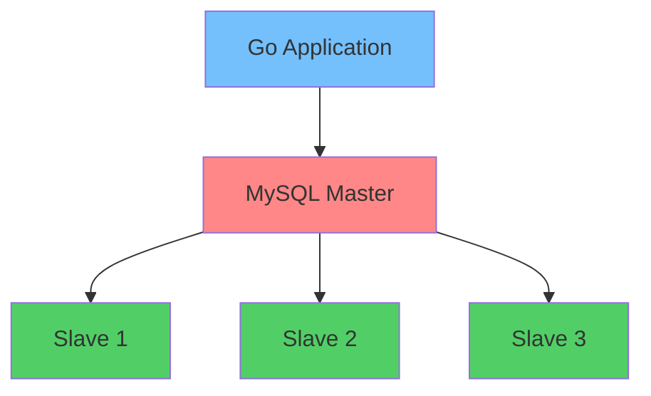

# 🚀 Go Database Replication

> Robust and scalable Go application with MySQL master-slave replication running in Docker containers! 💾


## 📖 Overview

This project demonstrates **high-availability database architecture** using MySQL master-slave replication with a Go backend. Perfect for learning about distributed systems and database scaling! 🎯

### ✨ Features

- 🏗 **Master-Slave Replication** - 1 Master + 3 Slave nodes
- 🐳 **Docker Containerization** - Easy deployment and scaling
- 🔄 **Automatic Failover** - Built-in replication monitoring
- ⚡ **High Performance** - Read scalability across multiple slave nodes
- 🔒 **Data Consistency** - ACID compliance with replication
- 📊 **Health Monitoring** - Built-in database health checks

## 🏗 Architecture



## 🛠 Technology Stack

| Component | Technology | Purpose |
|-----------|------------|---------|
| **Backend** |  | High-performance API server |
| **Database** |  | Primary data storage |
| **Containerization** |  | Environment isolation |
| **Orchestration** |  | Multi-container management |

## 🚀 Quick Start

### Prerequisites

- 🐳 [Docker](https://docs.docker.com/get-docker/) 
- 🐳 [Docker Compose](https://docs.docker.com/compose/install/)
- ⚙️ [Go 1.25.3+](https://golang.org/dl/) (for local development)

### Installation

1. **Clone the repository**
   ```bash
   git clone https://github.com/FollG/go-database-replication.git
   cd go-database-replication
   ```

2. **Start the environment**
   ```bash
   # Start all services (Master + 3 Slaves + Go Application)
   chmod +x \
      ./build/stop.sh \
      ./build/start.sh \
      ./build/status.sh \
      ./build/setup-replication.sh

   ./build/start.sh
   ```

3. **Verify services are running**
   ```bash
   ./build/status.sh
   ```
   ✅ You should see 5 running containers!

4. **Check replication status**
   ```bash
   # Connect to master and check slave status
   docker-compose exec mysql-master mysql -uroot -psecret -e "SHOW SLAVE HOSTS;"
   ```

## 📁 Project Structure

```
go-database-replication/
├── 📁 app/                 # Go application source code
│   ├── main.go            # Application entry point
│   ├── database/          # Database connection logic
│   └── models/            # Data models
├── 📁 config/             # Configuration files
│   ├── master.cnf         # MySQL Master configuration
│   └── slave.cnf          # MySQL Slave configuration
├── 📁 scripts/            # Database initialization scripts
├── docker-compose.yml     # Multi-container setup
└── README.md             # This file 🎉
```

## ⚙️ Configuration

### Environment Variables


| Variable | Default | Description |
|----------|---------|-------------|
| `DB_MASTER_HOST` | `mysql-master` | Master database host |
| `DB_MASTER_PORT` | `3306` | Master database port |
| `DB_SLAVE_HOSTS` | `slave1,slave2,slave3` | Comma-separated slave hosts |
| `MASTER_DB_USER` | `./configs.*.yaml` | Database username |
| `SLAVE_DB_USER` | `./configs.*.yaml` | Database username |
| `MASTER_DB_PASSWORD` | `./configs.*.yaml` | Database password |
| `DB_PASSWORD` | `./configs.*.yaml` | Database password |


## 🧪 Testing Replication

### Write to Master
```bash
# This will create data on the master node
curl -X POST http://localhost:8080/api/users/ \
  -H "Content-Type: application/json" \
  -d '{"name": "MisterFish", "email": "misterfish@gmail.com"}'
```

### Read from Slaves
```bash
# This will read from slave nodes (round-robin)
curl http://localhost:8080/api/users
```

## 🐛 Troubleshooting

### Common Issues

1. **Connection Refused**
   ```bash
   # Check if containers are running
   docker-compose ps
   
   # Check master logs
   docker-compose logs mysql-master
   ```

2. **Replication Not Working**
   ```bash
   # Check slave status
   docker-compose exec mysql-slave1 mysql -uroot -psecret -e "SHOW SLAVE STATUS\G"
   ```

3. **Application Can't Connect**
   ```bash
   # Verify network
   docker network ls
   docker network inspect go-database-replication_default
   ```

## 🤝 Contributing

We welcome contributions! 🎉 Here's how you can help:

1. 🍴 Fork the project
2. 🌿 Create your feature branch (\`git checkout -b feature/AmazingFeature\`)
3. 💾 Commit your changes (\`git commit -m 'Add some AmazingFeature'\`)
4. 📤 Push to the branch (\`git push origin feature/AmazingFeature\`)
5. 🔃 Open a Pull Request

## 📜 License

This project is licensed under the MIT License - see the [LICENSE](LICENSE) file for details.

## 🙏 Acknowledgments

- MySQL Documentation for replication setup
- Docker community for excellent containerization guides
- Go community for best practices and libraries

---

<div align="center">

**⭐ Don't forget to star the repository if you found it helpful! ⭐**

Made with ❤️ and ☕ by [FollG](https://github.com/FollG)

</div>
