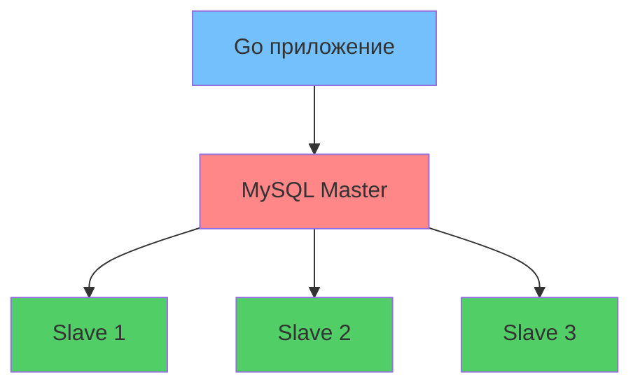

# 🚀 Репликация базы данных на Go

> Надежное и масштабируемое Go-приложение с MySQL master-slave репликацией, работающее в Docker-контейнерах! 💾


## 📖 Обзор

Этот проект демонстрирует **архитектуру базы данных высокой доступности** с использованием MySQL master-slave репликации и Go-бэкенда. Идеально подходит для изучения распределенных систем и масштабирования баз данных! 🎯

### ✨ Возможности

- 🏗 **Master-Slave репликация** - 1 Master + 3 Slave узла
- 🐳 **Docker-контейнеризация** - Простое развертывание и масштабирование
- 🔄 **Автоматический переход на резерв** - Встроенный мониторинг репликации
- ⚡ **Высокая производительность** - Масштабируемость чтения на нескольких slave-узлах
- 🔒 **Согласованность данных** - Соответствие ACID с репликацией
- 📊 **Мониторинг здоровья** - Встроенные проверки состояния базы данных

## 🏗 Архитектура



## 🛠 Технологический стек


| Компонент | Технология | Назначение |
|-----------|------------|---------|
| **Бэкенд** |  | Высокопроизводительный API-сервер |
| **База данных** |  | Основное хранилище данных |
| **Контейнеризация** |  | Изоляция окружения |
| **Оркестрация** |  | Управление мульти-контейнерами |

## 🚀 Быстрый старт

### Предварительные требования

- 🐳 [Docker](https://docs.docker.com/get-docker/) 
- 🐳 [Docker Compose](https://docs.docker.com/compose/install/)
- ⚙️ [Go 1.25.3+](https://golang.org/dl/) (для локальной разработки)

### Установка

1. **Клонируйте репозиторий**
   ```bash
   git clone https://github.com/FollG/go-database-replication.git
   cd go-database-replication
    ```

2. **Запустите окружение**
   ```bash
   # Запуск всех сервисов (Master + 3 Slave + Go приложение)
   docker-compose up -d
   ```

3. **Проверьте, что сервисы работают**
   ```bash
   docker-compose ps
   ```
   ✅ Вы должны увидеть 5 запущенных контейнеров!

4. **Проверьте статус репликации**
   ```bash
   # Подключитесь к master и проверьте статус slave-ов
   docker-compose exec mysql-master mysql -uroot -psecret -e "SHOW SLAVE HOSTS;"
   ```

## 📁 Структура проекта

```
go-database-replication/
├── 📁 app/                 # Исходный код Go-приложения
│   ├── main.go            # Точка входа приложения
│   ├── database/          # Логика подключения к БД
│   └── models/            # Модели данных
├── 📁 config/             # Файлы конфигурации
│   ├── master.cnf         # Конфигурация MySQL Master
│   └── slave.cnf          # Конфигурация MySQL Slave
├── 📁 scripts/            # Скрипты инициализации БД
├── docker-compose.yml     # Настройка мульти-контейнеров
└── README.md             # Этот файл 🎉
```

## ⚙️ Конфигурация

### Переменные окружения


| Переменная | По умолчанию | Описание |
|----------|---------|-------------|
| `DB_MASTER_HOST` | `mysql-master` | Хост master-базы данных |
| `DB_MASTER_PORT` | `3306` | Порт master-базы данных |
| `DB_SLAVE_HOSTS` | `slave1,slave2,slave3` | Список slave-хостов через запятую |
| `DB_USER` | `app_user` | Имя пользователя БД |
| `DB_PASSWORD` | `app_password` | Пароль БД |

## 🧪 Тестирование репликации

### Запись в Master
```bash
# Это создаст данные на master-узле
curl -X POST http://localhost:8080/api/data \
  -H "Content-Type: application/json" \
  -d '{"message": "Hello from Master!"}'
```

### Чтение из Slave
```bash
# Это будет читать из slave-узлов (round-robin)
curl http://localhost:8080/api/data
```

## 🐛 Решение проблем

### Частые проблемы

1. **Connection Refused**
   ```bash
   # Проверьте, запущены ли контейнеры
   docker-compose ps
   
   # Проверьте логи master
   docker-compose logs mysql-master
   ```

2. **Репликация не работает**
   ```bash
   # Проверьте статус slave
   docker-compose exec mysql-slave1 mysql -uroot -psecret -e "SHOW SLAVE STATUS\G"
   ```

3. **Приложение не может подключиться**
   ```bash
   # Проверьте сеть
   docker network ls
   docker network inspect go-database-replication_default
   ```

## 🤝 Участие в разработке

Мы рады contributions! 🎉 Вот как вы можете помочь:

1. 🍴 Сделайте форк проекта
2. 🌿 Создайте ветку для функции (`git checkout -b feature/AmazingFeature`)
3. 💾 Закоммитьте изменения (`git commit -m 'Add some AmazingFeature'`)
4. 📤 Запушьте в ветку (`git push origin feature/AmazingFeature`)
5. 🔃 Откройте Pull Request

## 📜 Лицензия

Этот проект лицензирован под MIT License - смотрите файл [LICENSE](LICENSE) для деталей.

## 🙏 Благодарности

- Документация MySQL за настройку репликации
- Сообщество Docker за отличные гайды по контейнеризации
- Сообщество Go за лучшие практики и библиотеки

---

<div align="center">

**⭐ Не забудьте поставить звезду репозиторию, если он был полезен! ⭐**

Сделано с ❤️ и ☕ от [FollG](https://github.com/FollG)

</div>
